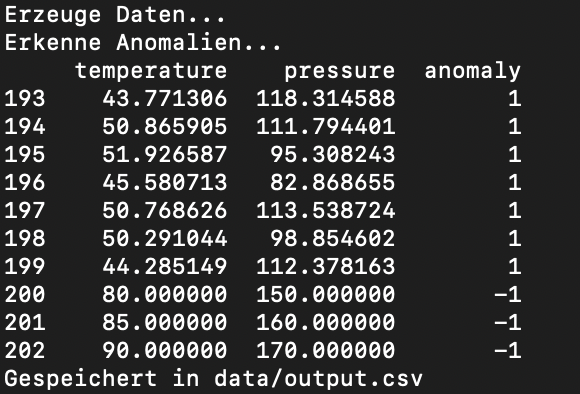
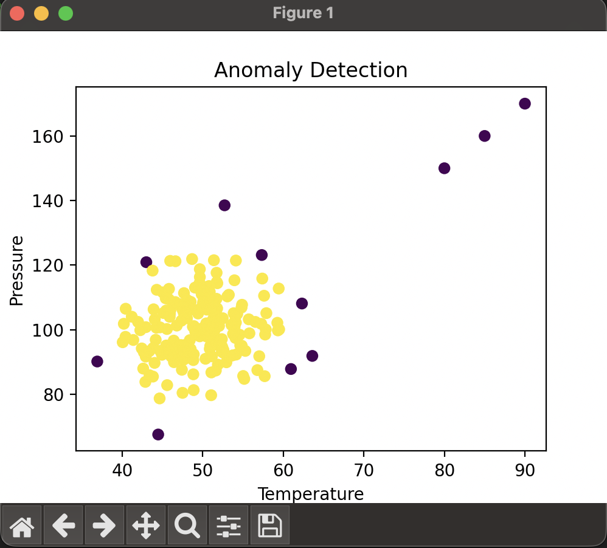

# Data Anomaly Detection

## Overview
This project simulates sensor data (e.g. temperature and pressure) and detects anomalies using a simple machine learning model.

It was created to explore basic data processing, anomaly detection and visualization workflows in Python.

## Technologies
- Python
- pandas
- numpy
- scikit-learn
- matplotlib

## What it does
- Generates synthetic sensor data  
- Adds a few outliers manually  
- Detects anomalies using Isolation Forest  
- Visualizes the detected anomalies  
- Saves the results to a CSV file  

## Output
The results are stored in:

`data/output.csv`

The column `anomaly` contains:
- `1` = normal value  
- `-1` = anomaly  

## Example Output

### Console Output


### Visualization


## Run the project
```bash
pip install -r requirements.txt
python main.py
