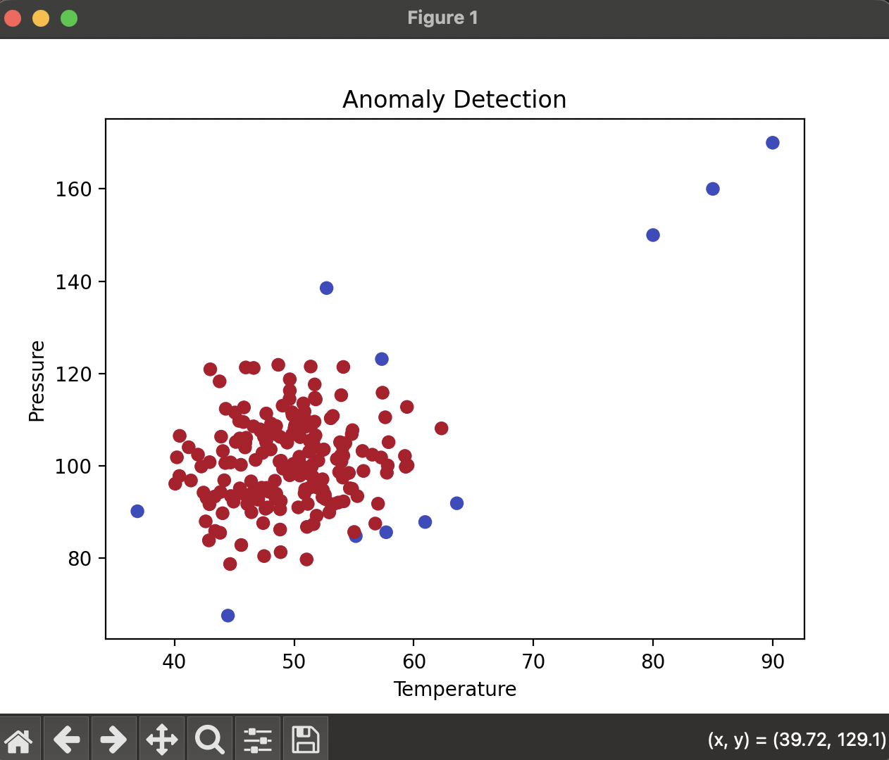

# Data Anomaly Detection Pipeline (Python)

## Context

This project is inspired by my Bachelor thesis on AI-based anomaly detection in critical infrastructure systems (e.g., water supply and SCADA systems).  
It demonstrates a simplified prototype of how anomalies in sensor data can be detected using machine learning.

## Overview

This project simulates sensor data (e.g. temperature, pressure, vibration, humidity) and detects anomalies using a machine learning model.

It represents a simple end-to-end data pipeline including data ingestion, processing, anomaly detection, and data export.

The implementation focuses on clean, modular Python code and reproducible data processing.

This pipeline follows an ETL-like workflow and can be extended to integrate real-world data sources such as APIs or databases.

## Data Pipeline



## Technologies

- Python
- pandas
- numpy
- scikit-learn
- matplotlib
- logging

## What it does

- Generates synthetic sensor data  
- Injects artificial anomalies  
- Applies anomaly detection using Isolation Forest  
- Logs pipeline execution  
- Visualizes the results  
- Exports processed data to CSV  

## Output

The results are stored in:

- `data/raw_data.csv` (full dataset)  
- `data/anomalies.csv` (detected anomalies)  

The column `anomaly` contains:
- `1` = normal value  
- `-1` = anomaly  

## Example Output

### Visualization


### Console Output


## Run the project

```bash
pip install -r requirements.txt
python main.py
